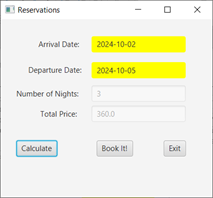
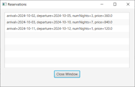

# Hotel Reservations

A simple JavaFX Maven project for managing hotel reservations.

# Tools Used

1. NetBeans IDE
   
2. MySQL

# Dependencies

1. Maven
   
2. JavaFX 13

# Installation

1. Open the project in NetBeans

2. Build with dependencies

3. Click "Allow Maven to install" in the bottom right corner when prompted

4. Run the project
